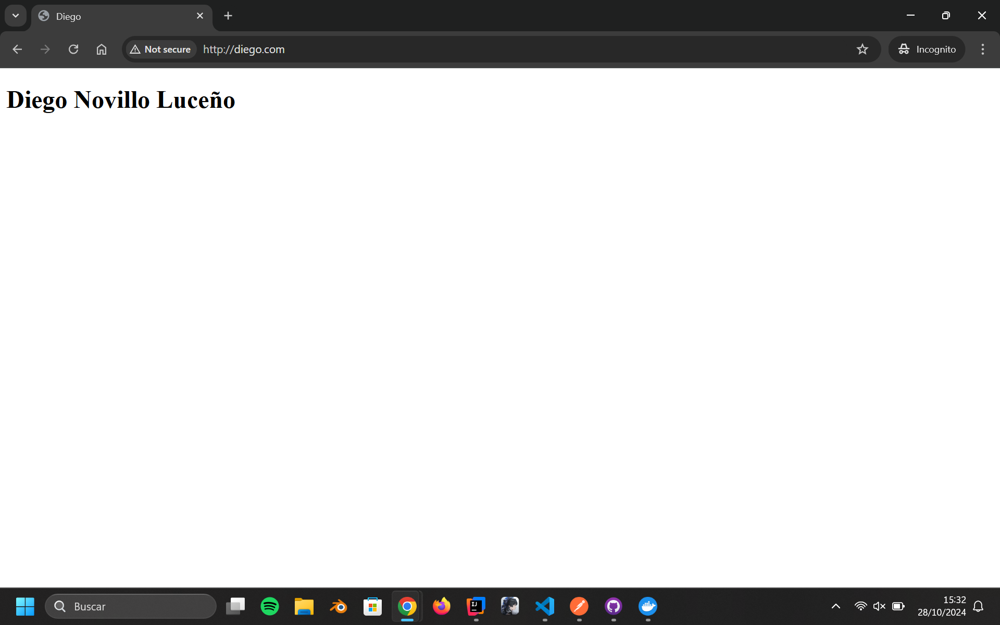
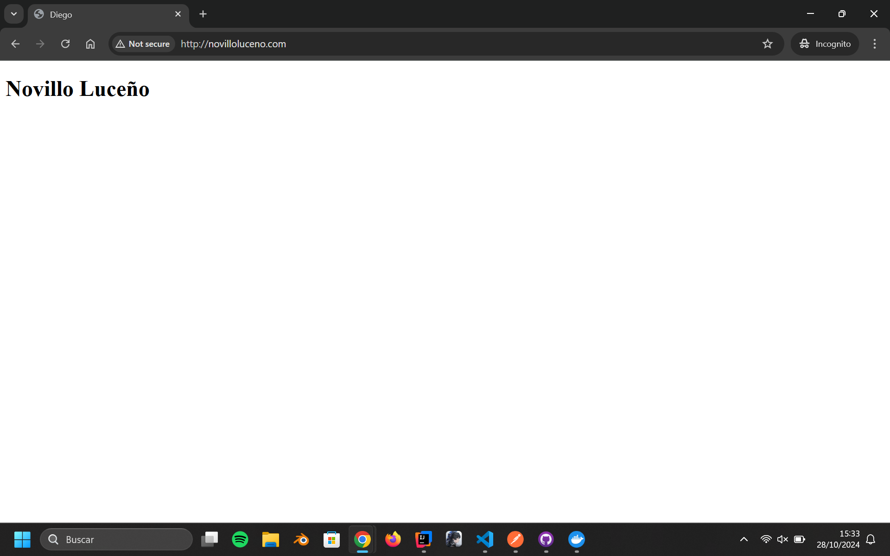
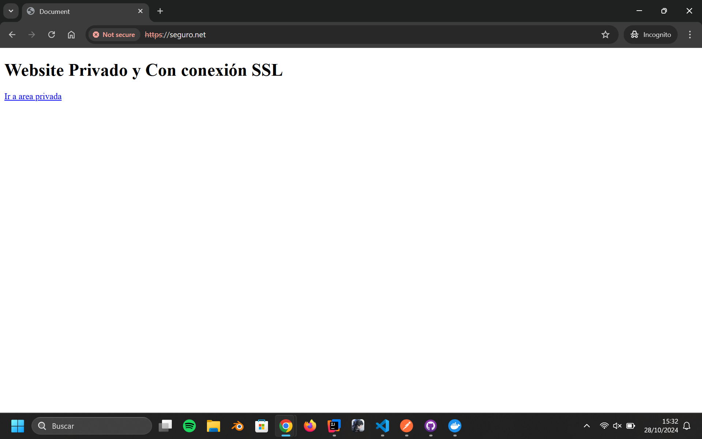
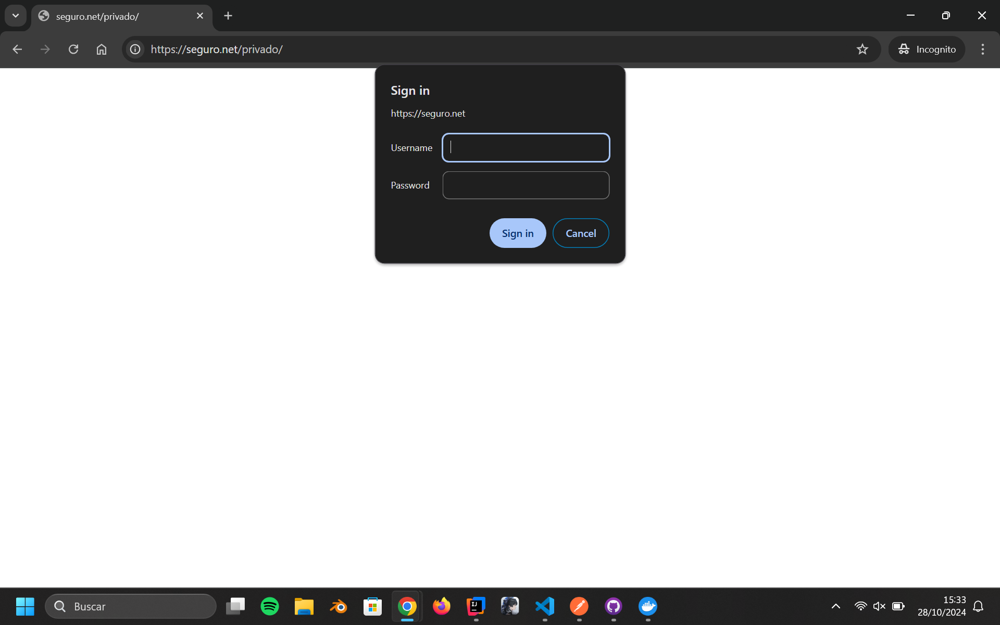
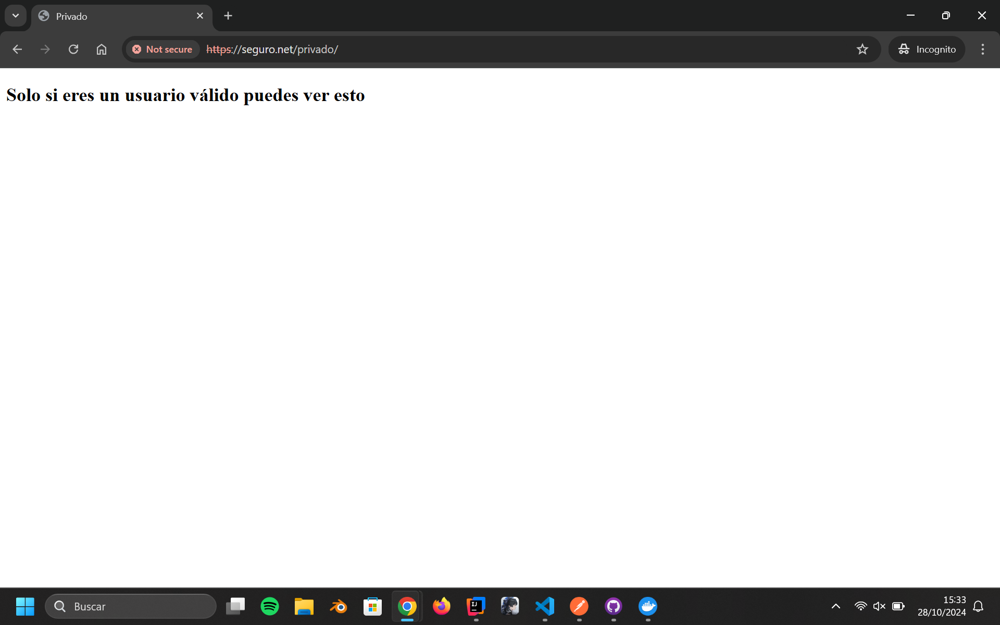

# Practica Nginx

## Explicación

Mi servidor está compuesto por 3 páginas web:

1. <b>diego.com</b>: una página simple http que contiene mi nombre y apellidos. 
2. <b>novilloluceno.com</b> una página simple http que contiene mis apellidos 
3. <b>seguro.net</b>: consiste en una pagina con protocolo https y una página "/privado" al que se debe acceder con un usuario y una contraseña. Ambas solo contienen un mensaje. 

Todas tienen una página de error 404 (Not Found) y para 500 (Server Error).

## Proceso

Tuve que crear una \*.conf para cada pagina dentro de una carpeta llamada "sites-available" que copiaré y habilitaré mas tarde. Dentro de todas tuve que añadir.

- listen: el puerto en el que estará la pagina web, le he puesto el 80 para no tener que ponerlo yo.
- server_name: el nombre del dominio de la página web.
- root: donde está el fichero que quiero que coja el html.
- index: con el nombre de la página que quieres que se carge, en mi caso siempre es index.html.
- location: que se asegura que sale el error 404 si la página que buscan no existe.

Para la página de \"seguro.net\" tuve que añadir otras cosas para habilitar https y hacer que la página \"seguro.net/privado\" esté protejida por usuario y contraseña.

También tuve que quitar los comentarios de algunas lineas del fichero \"nginx.conf\".

Dentro del fichero de configuración de la página \"seguro.net\" tuve que añadir lo siguiente:

- Unas líneas para configurar el ssl y especifican los ficheros del certificado y la llave que generé con openssl.
- Un nuevo \"location\" para la página "\\privado\" configurándolo para que este protegido con una contraseña y un usuario que están en el fichero \".htppasswd\".

Luego para habilitar las páginas hhay que crear un link en la carpeta de sites-enabled, que lo estoy haciendo en el fichero "\entrypoint.sh\" que se ejecutará cuando se lanze en docker.

Finalmente tuve que lanzar la aplicación con docker que estoy haciendo con un docker compose conn las siguientes carácteristicas: - Pasa el archivo \"entrypoint.sh\" para que habilite los sitios que he creado. - También incluyo todos los otros archivos que he modificado para que mi servidor funcione correctamente que incluyen: la configuración de nginx, el fichero .htpasswd, la carpeta con la configuración de los virtual hosts, los certificados y los html dentro de la carpeta \"website\". - Parte de una imagen de Ubuntu con nginx instalado. - Utiliza los puertos 80 y 443. El 80 para las páginas \"diego.com\" y \"novilloluceno.com\" y el 443 para \"seguro.net\".

## Capturas:

### diego.com

### novilloluceno.com

### seguro.net

##### Normal

##### LogIn

##### Entrado

